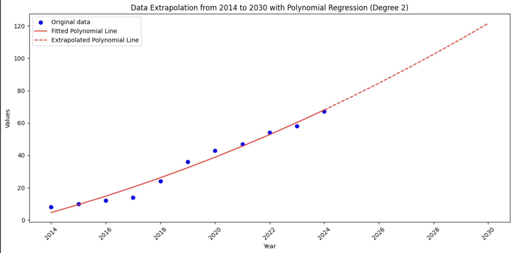

# AI Model Evaluations Quickstart Guide

Model evaluation is a technical field of AI safety and ML research focused on benchmarking and evaluating models. Sub-fields include Benchmarking, Dangerous Capability Evaluations, and Demonstrations. Related research topics include the governance of AI, alignment research, and scenario planning for AI.

This is a short overview of introductory material available in the field of model evaluations and will work as a guide for you to engage with the field.

_This is a work in progress and we invite interested parties to submit pull requests for new materials_

## Demonstrations research

### Demonstrating risks to institutional fragility from AI

[Visit to the democracy x AI hackathon](https://www.apartresearch.com/event/ai-democracy) where material for demonstrating and extrapolating risks to society from AI is the main topic.

Project examples include developing an LLM to contain a sleeper agent that activates on election day, training agents to skew poll results to inflate support for particular policies, or using an LLM to draft uncontroversial legislative proposals that, if implemented, indirectly impacts more contentious or harmful policies.

These are ideas to get you started and you can [check out the results](https://apartresearch.com/sprints#research) from previous hackathons to see examples of the types of projects you can develop during just one weekend, e.g. [EscalAItion](https://www.apartresearch.com/project/escalation-assessing-multi-agent-risks-in-military-contexts) found that LLMs had a propensity to escalate in military scenarios and was [accepted](https://openreview.net/forum?id=5HuBX8LvuT&utm_source=updates.apartresearch.com&utm_medium=referral&utm_campaign=apart-s-2023-wrapping-up-a-great-year) at the multi-agent security workshop at NeurIPS 2023 after further development.

### **Inspiration**

Here is some interesting material to get inspiration for the hackathon:

- [CivAI Demonstrations for Policy Makers](https://vimeo.com/935221775/79e7fbb14f)
- [A paper presenting a framework for AI and Democracy](https://journals.sagepub.com/doi/pdf/10.1177/20563051231186353)
- [Article by Yoshua Bengio in the Journal of Democracy](https://www.journalofdemocracy.org/ai-and-catastrophic-risk/)
- [Why it Matters podcast on The Year of AI and Elections](https://podcasts.apple.com/gb/podcast/the-year-of-ai-and-elections/id1482132871?i=1000639276052)
- [Guardian article about the influence of AI on the US elections](https://www.theguardian.com/us-news/2024/feb/26/ai-deepfakes-disinformation-election)
- [80000 hours podcast with Nina Schick on disinformation and the rise of synthetic media](https://80000hours.org/podcast/episodes/nina-schick-disinformation-synthetic-media/)
- [Rest of World tracks key global incidents of AI-generated election content](https://restofworld.org/2024/elections-ai-tracker/)
- [Weapons of Mass Destruction Proxy (WMDP) Benchmark](https://www.wmdp.ai/)
- [Spending $200 to make LLMs unsafe](https://simonlermen.com/assets/lora.pdf)
- [An experimental demonstration of strategic deception in LLMs](https://static1.squarespace.com/static/6593e7097565990e65c886fd/t/65a6f27438891c1e229bbbef/1705439862171/deception_under_pressure.pdf)

### Some starter code and Colabs for the hackathon

**Loading Open-source models in Google Colab**

See [this Colab notebook](https://colab.research.google.com/drive/14R13JqKsBgRqfIDgvp0ep9T6YG2BFY_V) to use the Transformerlens model downloader utility to easily load language models in Colab. It also has all the available models there from EleutherAI, OpenAI, Facebook AI Research, Neel Nanda and more. Alternatively, you can use [this notebook](https://colab.research.google.com/drive/171cZA-FJHYbeaD0ZG3IDeZ3OISTT-dUk?usp=sharing) to use the Replicate API to run the latest open-source language models, such as LLama-3.

You can also use the huggingface Transformers library directly [like this](<https://huggingface.co/docs/transformers/quicktour#:~:text=%3E%3E%3E%20model%20%3D%20AutoModelForSequenceClassification.-,from_pretrained,-(model_name)%0A%3E%3E%3E>).

**Extrapolating a trend into the future**

Simple [notebook](https://colab.research.google.com/drive/1durgWnT_Xz5d0Z2afolSwIOd-aDsbFgx?usp=sharing) that uses a polynomial regression to make a plot of an extrapolation of some data into the future.

**Notebooks by Hugging Face**

These notebooks all pertain to the usage of transformers and shows how to use their library. [See them all here](https://huggingface.co/docs/transformers/notebooks). Some notable notebooks include:

- [Fine-tuning a pretrained model](https://colab.research.google.com/github/huggingface/notebooks/blob/main/transformers_doc/en/training.ipynb)
- [How to benchmark models](https://github.com/huggingface/notebooks/blob/main/examples/benchmark.ipynb)

**Finetuning language model with OpenAI or Replicate**

This notebook provides an overview of how you can finetune LLMs, such as Replicate usage and more. [Go to the notebook here](https://colab.research.google.com/drive/1CUfHP3j1B_gP-45qvRG6VmF7koer59X-?usp=sharing#scrollTo=DGoPq4ziiU86).

**Cloning your voice**

This [notebook](https://colab.research.google.com/drive/1xl4Fakx9rslRXt0XHUcpN-aslSoEkDzN?usp=sharing) allows you to clone your own voice. 

**Language Model Evaluation Harness**

The LMEH is a set of [over 200 tasks](https://github.com/EleutherAI/lm-evaluation-harness/blob/master/docs/task_table.md) that you can automatically run your models through. You can easily use it by writing *pip install lm-eval* at the top of your script.

See a Colab notebook shortly introducing how to use it [here](https://colab.research.google.com/drive/1zmZfdETnQ-AR2BBIK3pFtnP5937J1yaz?usp=sharing).

Check out [the Github repository](https://github.com/EleutherAI/lm-evaluation-harness) and the [guide to adding a new benchmark](https://github.com/EleutherAI/lm-evaluation-harness/blob/master/docs/task_guide.md) so you can test your own tasks using their easy interface.

## Cyber capabilities evaluation

### Existing work

[METR's task suite](https://github.com/METR/public-tasks) tests for the ability of LLMs to complete tasks relevant to understanding autonomous and ML R&D AI capabilities. At the moment, they all require a level of cyber capability since they are computer-based tasks.

[SWEBench](https://www.swebench.com/) is the latest academic benchmark for LLM performance on difficult programming tasks based on about 2,000 Github commits across 12 Python repositories ([hf](https://huggingface.co/datasets/princeton-nlp/SWE-bench)). It seems the most widely used in recent months. For 11 previous benchmarks, we can see an overview from the CodeAgent paper's [review](https://www.semanticscholar.org/paper/CodeAgent%3A-Enhancing-Code-Generation-with-Agent-for-Zhang-Li/3793a5f435fef59a901f5ba0d8ef43df88d97161/figure/0).

### Scenarios for AI cyber risk

OpenAI's preparedness framework describes four levels of risk corresponding to 1) weak cyber assistance, 2) expert replacement, 3) development of MVP high-value exploits, and 4) devising and executing end-to-end novel attacks on hardened targets ([OpenAI, 2023](https://cdn.openai.com/openai-preparedness-framework-beta.pdf))

The responsible scaling policy ([Anthropic, 2023](https://www-cdn.anthropic.com/1adf000c8f675958c2ee23805d91aaade1cd4613/responsible-scaling-policy.pdf)) defines which safeguards to put in place for various sizes of models with a focus on catastrophic risk and containment strategies at capability levels measured by a task-based evaluation ([METR, 2024](https://taskdev.metr.org/introduction/)).

Google DeepMind ([2024](https://arxiv.org/pdf/2311.02462.pdf)) defines levels of AGI competence in narrow and general tasks according to levels competence with the highest level 5 defined as outperforming 100% of humans. Additionally, they define levels of autonomy, with the highest (level 5) being AI as an independent agent, as opposed to AI as an expert (level 4).

The weapons of mass destruction proxy (WMDP) benchmark ([Li et al., 2024](https://arxiv.org/pdf/2403.03218.pdf)) measures cyber risk according to accuracy on questions that proxy the potential for misuse assistance along four stages of a cyberattack: 1) Reconnaissance, 2) weaponization, 3) exploitation, and 4) post-exploitation.

From academia, Giudici et al. ([2024](https://www.sciencedirect.com/science/article/pii/S0957417423017220)) define a risk management framework for errors introduced by AI. Outside labs, Kokotajlo ([2022](https://www.lesswrong.com/posts/n3w3ww9Xuf8SngBfE/replacement-for-ponr-concept)) describes overpowering as an important metric. OpenAI's head of superalignment, Leike, describes ([2023](https://aligned.substack.com/p/self-exfiltration)) self-exfiltration as an important capability to mitigate due to the control implications.

## Science of Evaluations

Apollo Research argues that if AI model evaluations want to have meaningful real-world impact, we need a “Science of Evals" ([Apollo Research, 2024](https://www.apolloresearch.ai/blog/we-need-a-science-of-evals)). They provide a small overview of current work in the direction of science of evals:

1. Many different papers such as [Liang et al., 2022](https://arxiv.org/abs/2211.09110); [Mizrahi et al., 2023](https://arxiv.org/abs/2401.00595); [Scalar et al., 2023](https://arxiv.org/abs/2310.11324) find that different phrasings of the same question can lead to very different results thus suggesting to always evaluate LMs on a set of diverse prompts.
2. Multiple papers investigate how different ways of structuring an evaluation, e.g. as multiple choice or generative evaluation, can lead to substantially different results, e.g. [Robinson et al., 2022](https://arxiv.org/abs/2210.12353); [Wang et al., 2023](https://arxiv.org/abs/2311.05915); [Savelka et al., 2023](https://arxiv.org/abs/2303.08033), [Khatun et al, 2024](https://arxiv.org/abs/2401.07955#:~:text=We%20analyze%2026%20small%20open,MCQ%20tests%20with%20these%20models). Since model evaluations often try to make statements about the maximal capability of a model, it’s important to be aware of how a question is structured (e.g. discriminative vs. generative evaluation) and worded.
3. Several papers investigated the relationship between fine-tuning and prompting which has important implications for capability elicitation, e.g. [C. Wang et al., 2022](https://arxiv.org/pdf/2207.11680.pdf); [Liu et al., 2022](https://arxiv.org/pdf/2110.07602.pdf), [and Lin et al. 2023](https://arxiv.org/abs/2312.01552).
4. “With Little Power Comes Great Responsibility” ([Card et al., 2023](https://arxiv.org/abs/2010.06595)) investigates the statistical significance of typical ML experiments. This is a good example of how more rigorous hypothesis testing could be applied to evaluations.
5. “Are emergent capabilities a mirage?” ([Schaeffer et al., 2023](https://arxiv.org/abs/2304.15004)) argue that previously reported emergent capabilities of LMs ([Wei et al., 2022](https://arxiv.org/abs/2206.07682), [Srivastava et al. 2022](https://arxiv.org/abs/2206.04615)) primarily depend on the metric used, e.g. accuracy vs. log-likelihood. While these flaws had already been recognized by [Wei et al., 2022](https://arxiv.org/abs/2206.07682) and [Srivastava et al. 2022](https://arxiv.org/abs/2206.04615), it is very valuable to rigorously understand how the choice of metric can influence the perceived capabilities.
6. “True few-shot learning with Language Models” ([Perez et al., 2021](https://proceedings.neurips.cc/paper/2021/file/5c04925674920eb58467fb52ce4ef728-Paper.pdf)) argues that common few-shot techniques at the time would bias the results and thus overestimate the true abilities of LMs. Concretely, many evaluations would select few-shot examples based on a held-out validation set, instead of randomly sampling them. This emphasizes the importance of adequately designing the evals, e.g. not accidentally leaking information from the test set.
7. “Elo Uncovered: Robustness and Best Practices in Language Model Evaluation” ([Boubdir et al., 2023](https://arxiv.org/pdf/2311.17295.pdf)) investigates whether the commonly used ELO ranking to compare LMs ([Zheng et al. 2023](https://arxiv.org/abs/2306.05685)) fulfills two core desiderata, _reliability_ and _transitivity_, in practice. Thus it is a good example of empirically validating evals methodology.
8. Model evaluation survey papers like [Chang et al., 2023](https://arxiv.org/abs/2307.03109) summarize the state of the field, discuss trends and examples, and explicitly call for model evaluations as an explicit discipline. [Zhang et al. 2023](https://arxiv.org/abs/2312.07398) and [Ivanova 2023](https://arxiv.org/abs/2312.01276)'s "Running cognitive evaluations on large language models: The do's and the don'ts" are initial work in meta-evaluating model evaluations as a field and proposing concrete recommendations.
